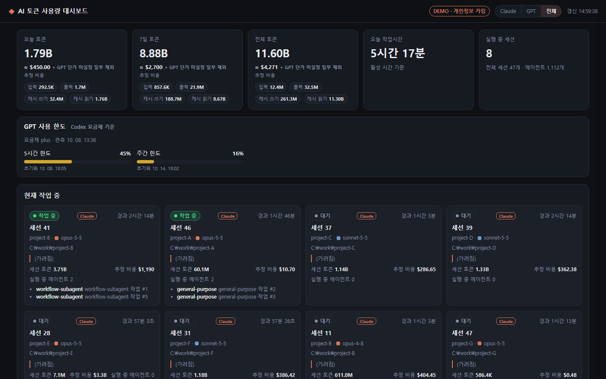
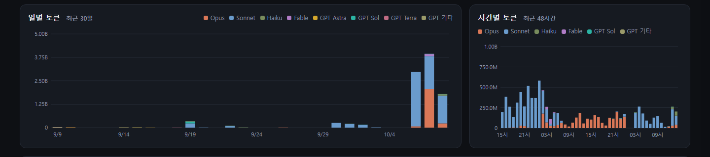
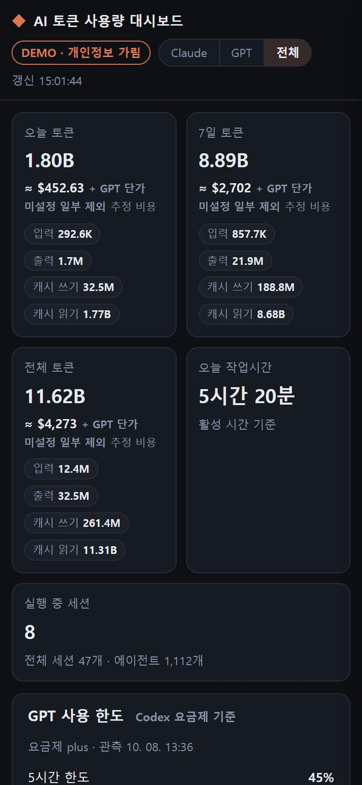

# AI 토큰 사용량 대시보드 (token-dashboard)

로컬에 남은 Claude Code / OpenAI Codex(GPT) 사용 기록을 읽어 토큰 사용량, 작업 시간, 실행 중인 세션을 한 화면에 보여주는 **읽기 전용** 로컬 웹 대시보드입니다.

[](https://youtu.be/ouR9nL3lefw)

데모 영상: https://youtu.be/ouR9nL3lefw

## 주요 기능

- **세션 / 서브에이전트별 토큰 사용량**: input, output, cache write, cache read 토큰과 합계를 세션·에이전트 단위로 집계합니다.
- **작업 시간**: 타임스탬프 간격이 5분 이하인 구간만 더한 활성 시간(`activeMs`)과 처음부터 마지막까지의 경과 시간(`wallMs`)을 보여줍니다.
- **현재 작업 중 패널**: 실행 중인 세션을 작업 중 / 대기 상태와 경과 시간(1초 단위로 갱신)과 함께 표시합니다.
- **차트**: 최근 30일 일별 누적 막대(모델 계열별), 최근 48시간 시간별 막대, 모델별 점유율.
- **추정 비용**: API 정가 기준 추정치입니다. 구독 요금이 아닙니다.
- **Claude / GPT / 전체 토글**: 두 제공자 중 보고 싶은 쪽만 볼 수 있습니다. 로그가 하나뿐이면 토글은 숨겨집니다.
- **GPT 사용 한도 게이지**: Codex 로그에 기록된 5시간 / 주간 한도 사용률과 초기화 시각을 보여줍니다.
- **세션 목록**: 검색, 필터(전체 / 실행 중 / 오늘 / 7일), 열 정렬. 행을 누르면 모델별·에이전트별 상세가 열립니다.
- **데모 모드**: `--demo` 로 실행하면 제목, 프로젝트명, 경로, 프롬프트를 가린 채 화면을 띄웁니다. 화면 녹화용입니다.

### 스크린샷





<p align="center"></p>

> 스크린샷은 데모 모드(`demo.bat`, 포트 7778)에서 찍은 화면입니다. 실제 프로젝트명이나 프롬프트는 들어 있지 않습니다.

## 요구 사항

- **Node.js**: 개발과 테스트는 Node.js 24에서 했습니다. 외부 패키지 없이 Node 내장 모듈(`http`, `fs`, `path`, `os`, `crypto`, `url`)만 씁니다. 더 낮은 버전은 검증하지 않았으므로 **Node 20 이상을 권장**합니다.
- **OS**: Windows에서 주로 확인했습니다 (`start.bat`, `demo.bat` 포함). macOS / Linux에서도 `node server.js` 로 실행할 수 있지만 검증은 충분하지 않습니다.
- **데이터**: Claude Code 로그(`~/.claude`) 또는 Codex 로그(`~/.codex`) 중 하나 이상.
- npm 설치는 필요 없습니다.

## 빠른 시작

```bash
git clone https://github.com/<your-account>/token-dashboard.git
cd token-dashboard
node server.js
```

Windows에서는 `start.bat` 을 더블클릭해도 됩니다. 그다음 브라우저에서 **http://localhost:7777** 을 엽니다. 로그인 없이 바로 열립니다.

처음 실행하면 전체 스캔에 수 초에서 수십 초가 걸리며, 그동안 화면에 "스캔 중 x/y" 표시가 나옵니다. 스캔 결과는 `.cache/scan-cache.json` 에 저장되어 다음 실행부터는 빨리 시작합니다. 캐시를 지우면 다시 전체 스캔합니다.

## 데모 모드

화면 녹화나 스크린샷처럼 개인 정보가 보이면 안 될 때 씁니다.

```bash
node server.js --demo        # 또는 환경변수 DEMO=1
```

Windows에서는 `demo.bat` 을 실행하면 포트 **7778** 로 뜹니다. 데모 모드에서는 다음이 바뀝니다.

- 세션 제목은 `세션 N`, 프로젝트는 `project-A` 처럼 바뀌고 경로와 프롬프트는 `(가려짐)` 으로 표시됩니다.
- 상단에 `DEMO · 개인정보 가림` 배지가 붙습니다.
- 데모용 캐시 파일(`scan-cache-demo.json`)을 따로 씁니다.

가림 처리는 서버에서 합니다. 브라우저로 나가는 API 응답 자체에 실제 값이 들어가지 않습니다.

## 설정

### `config.json`

| 키 | 기본값 | 설명 |
| --- | --- | --- |
| `port` | `7777` | 대시보드 포트 |
| `host` | `"127.0.0.1"` | 바인드 주소. 이 PC에서만 접속할 수 있습니다. |
| `claudeDir` | `""` | Claude 데이터 폴더. 비우면 `사용자폴더/.claude` 를 씁니다. |
| `codexDir` | `""` | Codex 데이터 폴더(`sessions/`, `session_index.jsonl` 이 있는 곳). 비우면 `사용자폴더/.codex` 를 씁니다. 폴더가 없으면 GPT는 표시되지 않습니다. |
| `codexPricing` | `{}` | GPT 단가 덮어쓰기 (USD / 1M 토큰). 키는 모델 id의 부분 문자열이고, 값은 `{input, output, cacheRead, cacheWrite}` 입니다. 같은 키는 내장 단가를 대체하고 새 키는 추가됩니다. |

예시:

```json
{
  "port": 7777,
  "host": "127.0.0.1",
  "claudeDir": "",
  "codexDir": "",
  "codexPricing": {
    "gpt-5.6-sol": { "input": 4, "output": 20, "cacheRead": 0.4, "cacheWrite": 5 }
  }
}
```

- `config.json` 이 없으면 기본값으로 자동 생성됩니다.
- 설정을 바꾸면 서버를 재시작해야 합니다.

### 환경변수

| 변수 | 설명 |
| --- | --- |
| `PORT` | 포트. `config.json` 의 `port` 보다 우선합니다. 예: `set PORT=7799 && node server.js` |
| `CODEX_DIR` | Codex 폴더. `codexDir` 보다 우선합니다. 없는 폴더를 주면 Codex가 없는 상태를 테스트할 수 있습니다. |
| `DASHBOARD_CACHE` | 캐시 파일 경로. 테스트 서버처럼 캐시를 따로 쓰고 싶을 때 씁니다. |
| `DEMO` | `1` 이면 데모 모드 (`--demo` 와 같음) |

## 계산 방식

- **중복 제거**: 같은 `message.id` 는 한 번만 셉니다. 한 응답이 여러 줄로 나뉘어 같은 usage가 반복되므로, 마지막 줄의 usage만 씁니다.
- **증분 읽기**: 파일은 마지막으로 읽은 바이트 위치부터 추가된 부분만 읽습니다. 줄이 끝나지 않은 조각은 다음 갱신 때 이어서 처리합니다.
- **작업 시간(`activeMs`)**: 연속된 타임스탬프 간격이 5분 이하인 구간의 합입니다. 5분을 넘는 공백은 작업으로 치지 않습니다.
- **서브에이전트**: `subagents/` 아래 하위 폴더(`subagents/workflows/<wf>/` 포함)까지 찾습니다.
- **실행 중 판단**: Claude는 `sessions/<pid>.json` 파일이 있고 해당 프로세스가 살아 있을 때 실행 중으로 봅니다. Codex는 파일 수정 시각으로 판단합니다. 10분 이내에 작업이 시작됐으면 작업 중, 30분 이내면 대기입니다.
- **Codex 집계**: `rollout-*.jsonl` 의 `token_usage_record` 줄을 응답 단위로 셉니다(`response_id` 로 중복 제거). 해당 줄이 없는 파일은 `event_msg.token_count` 의 `last_token_usage` 를 씁니다. Codex 서브에이전트(가드레일 리뷰 포함)는 `parent_thread_id` 를 따라 상위 세션에 붙습니다.
- **세션 제목**: Claude는 커스텀 제목, 에이전트 이름, 첫 프롬프트 순으로 씁니다. Codex는 `session_index.jsonl` 의 `thread_name` 을 쓰고, 없으면 첫 프롬프트를 씁니다.
- `<synthetic>` 모델은 집계에서 뺍니다.

### 추정 비용

- 비용은 **API 정가로 계산한 추정치**입니다. 구독 요금이나 실제 청구 금액이 아닙니다.
- ChatGPT 요금제로 쓴 Codex 사용량은 토큰 단위로 과금되지 않습니다. 그래도 같은 기준으로 환산해 보여줍니다.
- **Claude 단가**: `lib/pricing.js` 의 내장 표입니다. Anthropic API 정가 기준이며, 모델 계열별로 입력·출력·캐시 읽기 단가를 둡니다. 캐시 쓰기는 입력 단가의 1.25배(5분) 또는 2배(1시간)입니다. 기준일 2026-10-08 (Anthropic 공식 가격표).
- **GPT 단가**: OpenAI 공식 가격표를 기준으로 한 내장 표입니다. 단기 컨텍스트(≤272K), 표준 등급, 기준일 2026-10-08. 표에 없는 모델(예: `codex-auto-review`)은 `단가 미설정`으로 표시하고 비용에서 뺍니다.
- 가격이 바뀌었거나 다른 값을 쓰고 싶으면 `config.json` 의 `codexPricing` 으로 GPT 단가를 덮어쓸 수 있습니다. Claude 단가는 `lib/pricing.js` 를 직접 고칩니다.

## 보안과 안전

- **읽기 전용**: Claude 및 Codex 데이터 폴더에 쓰지 않습니다. 입력을 보내거나 명령을 실행하지 않습니다.
- **로컬 전용**: 기본 바인드 주소는 `127.0.0.1` 입니다. 같은 네트워크의 다른 기기에서는 접속할 수 없습니다.
- **인증 없음**: 로그인(PIN) 기능은 없습니다. 모든 페이지와 API가 인증 없이 열립니다. `host` 를 `0.0.0.0` 으로 바꾸면 같은 네트워크에 노출되므로 권장하지 않습니다.
- **외부 통신 없음**: 서버는 외부 주소로 요청하지 않습니다. 화면은 자기 서버의 파일만 불러오고, CSP(`connect-src 'self'`)로 외부 연결을 막습니다.
- **API**: `/api/*` 는 GET만 받습니다.

## API

| 메서드 | 경로 | 설명 |
| --- | --- | --- |
| GET | `/api/summary?provider=all\|claude\|codex` | 요약 (기본 `all`) |
| GET | `/api/session/:id` | 세션 상세 (에이전트 목록, 날짜별 합계) |
| GET | `/api/meta` | `{demo: true\|false}` |

`/api/summary` 주요 필드:

- `scanning`, `progress: {done, total}`: 초기 스캔 상태
- `totals`, `today`, `last7d`: 토큰, 모델별, 작업 시간
- `daily`: 최근 30일, 오래된 날짜부터
- `hourly`: 최근 48시간 `{"YYYY-MM-DDTHH": 합계}`
- `live`: 실행 중인 세션, `sessions`: 전체 세션(마지막 활동 내림차순)
- `pricing`: 비용 설명과 단가표

토큰 값은 `{input, output, cacheCreate, cacheRead, total}` 객체입니다. `total` 은 네 값의 합입니다.

## 프로젝트 구조

```
server.js           HTTP 서버, API 라우팅, 정적 파일 제공
lib/scanner.js      transcript 파싱, 증분 집계, 캐시, 실행 상태 판단
lib/codex.js        Codex 로그 해석
lib/pricing.js      Claude / GPT 비용 추정 (순수 함수)
lib/mask.js         데모 모드 가림 처리
public/             화면 (index.html, app.js, style.css)
config.json         설정
start.bat           Windows 실행 스크립트
demo.bat            Windows 데모 실행 스크립트 (포트 7778)
docs/images/        README 스크린샷
docs/specs/         설계 메모 (SPEC, SPEC-v2, SPEC-v3)
docs/youtube/       데모 영상 제작 자료
.cache/             스캔 캐시 (자동 생성, 저장소에 올리지 않음)
```

### 설계 메모

구현 전에 쓴 설계 문서입니다. 현재 동작과 다른 부분이 있습니다. 예를 들어 PIN 로그인과 `0.0.0.0` 바인드 예시는 지금은 쓰지 않습니다.

- [docs/specs/SPEC.md](docs/specs/SPEC.md): 기본 설계, 데이터 소스, 집계, UI
- [docs/specs/SPEC-v2.md](docs/specs/SPEC-v2.md): 추정 비용, 시간별 계열 분리, 정렬
- [docs/specs/SPEC-v3.md](docs/specs/SPEC-v3.md): 다중 제공자 (Claude / Codex)

## FAQ / 문제 해결

**화면이 "스캔 중"에서 멈춰 있어요.**
로그가 많으면 첫 스캔이 오래 걸릴 수 있습니다. 진행률(x/y)이 올라가는지 확인하세요. 계속 멈춰 있으면 서버 콘솔의 오류 로그를 보고, `.cache/` 를 지우고 다시 실행해 보세요.

**`http://localhost:7777` 에 접속이 안 돼요.**
서버 콘솔에 `server error` 가 있는지 확인하세요. 포트가 이미 쓰이는 경우가 많습니다. `set PORT=7799 && node server.js` 처럼 다른 포트로 실행할 수 있습니다.

**GPT 탭이 안 보여요.**
`~/.codex/sessions` 가 없으면 GPT 제공자는 나타나지 않습니다. Codex 폴더가 다른 곳이면 `codexDir` 또는 `CODEX_DIR` 로 지정하세요.

**GPT 비용이 `단가 미설정`이에요.**
내장 단가표에 없는 모델입니다. `config.json` 의 `codexPricing` 에 모델 id 일부와 단가를 넣고 서버를 재시작하세요.

**비용이 실제 청구 금액과 달라요.**
정상입니다. 이 값은 API 정가 기준 추정치이며 구독 요금과 무관합니다.

**작업 시간이 실제보다 짧게 나와요.**
5분 이상 공백은 작업 시간에서 뺍니다. 설계된 동작입니다.

**스캔 결과를 초기화하고 싶어요.**
`.cache/scan-cache.json` 을 지우고 서버를 재시작하세요. 데모 캐시는 `.cache/scan-cache-demo.json` 입니다.

**이 대시보드가 Claude에 데이터를 보내나요?**
아닙니다. 로컬 파일을 읽어 화면에 보여줄 뿐입니다. 외부로 보내는 요청은 없습니다.

## 라이선스

MIT. 자세한 내용은 [LICENSE](LICENSE) 를 보세요.

---

## English

**token-dashboard** is a read-only, local web dashboard. It reads your local Claude Code logs (`~/.claude`) and OpenAI Codex logs (`~/.codex/sessions`) and shows token usage, active work time, live sessions, and estimated API list-price cost. It uses only Node.js built-in modules, binds to `127.0.0.1`, has no auth, and makes no network calls.

- **Run:** `node server.js` (or `start.bat` on Windows), then open http://localhost:7777. Node 20+ recommended; developed and tested on Node 24.
- **Demo mode:** `node server.js --demo` (or `demo.bat`, port 7778) masks session titles, project names, paths and prompts for screen recording.
- **Cost figures** are estimates at API list prices. They are not your subscription bill.
- **Config:** `config.json` (`port`, `host`, `claudeDir`, `codexDir`, `codexPricing`) and env vars `PORT`, `CODEX_DIR`, `DASHBOARD_CACHE`, `DEMO`.
- **Design notes:** `docs/specs/` (SPEC, SPEC-v2, SPEC-v3). Parts of these are outdated (e.g. PIN login).
- **Demo video:** https://youtu.be/ouR9nL3lefw

License: MIT.
